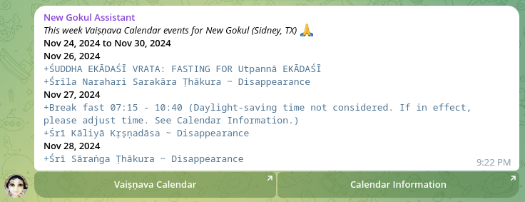

# Vaiṣṇava Calendar Reminder App

A sample app that uses [vaisnava-calendar-data-collection](https://github.com/gauracreative/vaisnava-calendar-data-collection) to send reminders for special events on Telegram.

## Installation Instructions

1. **Clone the Repository**:
   ```bash
   git clone https://github.com/gauracreative/vcalapp.git
   cd vcalapp
    ```
2. **Install Node Modules**:

```bash
npm install
```

3. **Set Up the Environment File**: Copy the example .env.dist file and adjust it with your configuration:

```bash
cp .env.dist .env
```

- **DATA_URL**: URL pointing to your calendar data. Consult the vaisnava-calendar-data-collection documentation for details.
- **TELEGRAM_BOT_TOKEN**: Create a Telegram bot via BotFather and add the token here.
- **TELEGRAM_CHAT_ID**: Add your Telegram group, channel, or personal chat ID where reminders will be sent. Don’t forget to add your bot to the group/channel if applicable.

## Usage

- Run the app manually to send events:

    ```bash
    node index.js today
    ```
- Send tomorrow’s events:

    ```bash
    node index.js tomorrow
    ```
- Send this week’s events:

    ```bash
    node index.js week
    ```

### Automate with Cron Jobs

You can automate reminders by setting up a cron job. Follow these steps:

1. **Edit Crontab**: Open the cron editor:

```bash
crontab -e
```
2. **Add Jobs**: Add the following entries to schedule the reminders:
```bash
# Run the script for today's events at 4 AM every day except Sunday
0 4 * * 1-6 node /path/to/index.js today

# Run the script for tomorrow's events at 9 AM every day except Sunday
0 9 * * 1-6 node /path/to/index.js tomorrow

# Run the script for this week's events at 4 AM on Sunday
0 4 * * 0 node /path/to/index.js week

```

**Explanation of Schedule**:

- `0 4 * * 1-6`: Executes at 4:00 AM, Monday to Saturday.
- `0 9 * * 1-6`: Executes at 9:00 AM, Monday to Saturday.
- `0 4 * * 0`: Executes at 4:00 AM on Sunday.

3. **Save and Exit**: Save the file in your preferred editor (e.g., vim, nano) and exit. The cron jobs are now active.

---

## Additional Notes

- Ensure the environment file (`.env`) contains the correct `DATA_URL`, `TELEGRAM_BOT_TOKEN`, and `TELEGRAM_CHAT_ID`.
- Use `node index.js` with the appropriate argument to test each functionality before adding it to `cron`.
- For advanced scheduling or monitoring, consider using a process manager like [PM2](https://pm2.keymetrics.io/).

Enjoy sending timely Vaiṣṇava reminders! 🙏


